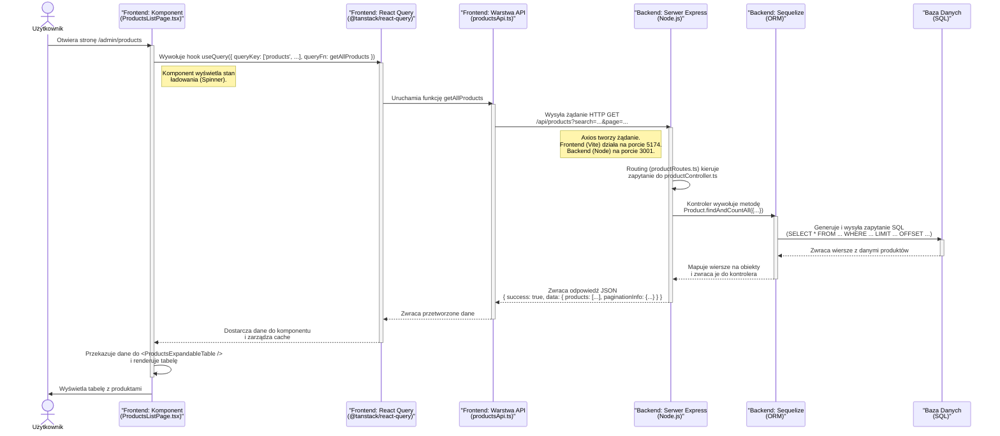

### Diagram komunikacji API



### Szczegółowy opis krok po kroku

Oto opis poszczególnych etapów i narzędzi biorących udział w procesie, który został przedstawiony na diagramie.

#### 1. Frontend - Inicjacja zapytania

Cykl rozpoczyna się, gdy użytkownik wchodzi na stronę z listą produktów.

- **Plik:** `src/pages/admin/ProductsListPage.tsx`
- **Narzędzia:** React, TanStack Query (`@tanstack/react-query`)
- **Proces:**
  1.  Komponent `ProductsListPage` jest renderowany.
  2.  Wewnątrz komponentu zostaje wywołany hook `useQuery`.
  3.  `useQuery` otrzymuje unikalny klucz `["products", ...]`, który służy do cachowania danych, oraz funkcję `getAllProducts`, która ma zostać wykonana w celu pobrania danych.
  4.  Dopóki dane nie zostaną pobrane, `useQuery` zwraca `isLoading: true`, co powoduje wyświetlenie komponentu `<Spinner />`.
  5.  Następnie `useQuery` wywołuje funkcję `getAllProducts` przekazaną w konfiguracji.

#### 2. Frontend - Warstwa komunikacji z API

Ta warstwa jest odpowiedzialna za faktyczne sformułowanie i wysłanie żądania do backendu.

- **Plik:** `src/api/productsApi.ts`
- **Narzędzia:** Axios
- **Proces:**
  1.  Funkcja `getAllProducts` jest uruchamiana.
  2.  Używa `axiosInstance` (prekonfigurowanej instancji Axios) do wysłania żądania `GET` pod endpoint zdefiniowany w `src/constants.ts` jako `API_ENDPOINTS.PRODUCTS.BASE` (czyli `/products`).
  3.  Do żądania dołączane są parametry, takie jak `page` i `search`, pobrane z klucza `queryKey`.
  4.  Frontend, działający na serwerze Vite (np. na `localhost:5174`), wysyła żądanie do backendu, który (dzięki konfiguracji proxy w `vite.config.ts`) nasłuchuje na `localhost:3001`.

#### 3. Backend - Odbiór i przetwarzanie żądania

Serwer Node.js odbiera żądanie i kieruje je do odpowiedniego kontrolera.

- **Pliki:** `backend/src/server.ts`, `backend/src/routes/productRoutes.ts`, `backend/src/controllers/productController.ts`
- **Narzędzia:** Node.js, Express, Nodemon
- **Proces:**
  1.  Serwer Express, uruchomiony za pomocą `nodemon` (dzięki skryptowi `npm run dev`), odbiera przychodzące żądanie `GET /api/products`.
  2.  Główny system routingu Expressa przekazuje żądanie do routera zdefiniowanego w `productRoutes.ts`.
  3.  Router ten mapuje ścieżkę `/` (w jego kontekście `/products`) do funkcji `getAllProducts` w kontrolerze `productController.ts`.
  4.  Funkcja w kontrolerze odczytuje parametry (`page`, `limit`, `search`) z obiektu `req.query`.

#### 4. Backend - Interakcja z bazą danych

Kontroler komunikuje się z bazą danych, aby pobrać potrzebne dane.

- **Pliki:** `backend/src/controllers/productController.ts`, `backend/src/models/deliveries/DostDostawyProdukty.ts`
- **Narzędzia:** Sequelize (ORM)
- **Proces:**
  1.  Kontroler wykorzystuje model Sequelize o nazwie `Product` (który jest aliasem dla `DostDostawyProdukty`).
  2.  Wywoływana jest metoda `Product.findAndCountAll({...})`. Jest to kluczowa funkcja Sequelize, która wykonuje dwie rzeczy: pobiera listę rekordów pasujących do kryteriów (`where`, `limit`, `offset`) oraz zlicza całkowitą liczbę pasujących rekordów (niezbędne do paginacji).
  3.  Sequelize na podstawie tej metody generuje zoptymalizowane zapytanie SQL (np. `SELECT * FROM "dost_dostawy_produkty" WHERE "nazwa_produktu" ILIKE '%...%' ORDER BY ... LIMIT 10 OFFSET 0;`).
  4.  Zapytanie jest wysyłane do serwera bazy danych (np. PostgreSQL).

#### 5. Baza Danych - Wykonanie zapytania

- **Narzędzia:** System bazodanowy (np. PostgreSQL, MySQL)
- **Proces:**
  1.  Baza danych wykonuje otrzymane zapytanie SQL.
  2.  Zwraca do backendu zestaw wierszy (rekordów) pasujących do zapytania.

#### 6. Backend - Formułowanie odpowiedzi

Po otrzymaniu danych z bazy, backend przygotowuje odpowiedź do wysłania na frontend.

- **Plik:** `backend/src/controllers/productController.ts`
- **Proces:**
  1.  Sequelize mapuje otrzymane surowe wiersze na instancje modelu `Product`.
  2.  Kontroler oblicza `totalPages` na podstawie całkowitej liczby rekordów (`count`).
  3.  Na koniec konstruuje obiekt odpowiedzi w ściśle określonym formacie, którego oczekuje frontend:
      ```json
      {
        "success": true,
        "data": {
          "products": [...], // tablica obiektów z bazy
          "paginationInfo": { ... } // informacje o paginacji
        }
      }
      ```
  4.  Odpowiedź jest wysyłana z powrotem do klienta z kodem statusu `200 OK`.

#### 7. Frontend - Odbiór i wyświetlenie danych

Frontend odbiera odpowiedź i finalizuje proces, wyświetlając dane użytkownikowi.

- **Pliki:** `src/api/productsApi.ts`, `src/pages/admin/ProductsListPage.tsx`
- **Proces:**
  1.  Axios w `productsApi.ts` odbiera odpowiedź. Obietnica (`Promise`) zostaje pomyślnie rozwiązana, a dane są przekazywane dalej.
  2.  `useQuery` otrzymuje dane, zapisuje je w swoim wewnętrznym cache pod kluczem `["products", ...]`, a następnie aktualizuje stan komponentu, ustawiając `isLoading: false`, `isSuccess: true` i przekazując pobrane dane.
  3.  Komponent `ProductsListPage` zostaje ponownie renderowany, tym razem z danymi produktów.
  4.  Dane są mapowane za pomocą funkcji `mapApiToTableProduct` w celu dostosowania nazw pól (np. `id_produktu_dostawy` na `id`).
  5.  Przekształcona tablica produktów jest przekazywana jako `props` do komponentu `ProductsExpandableTable`, który ostatecznie renderuje tabelę widoczną dla użytkownika.
